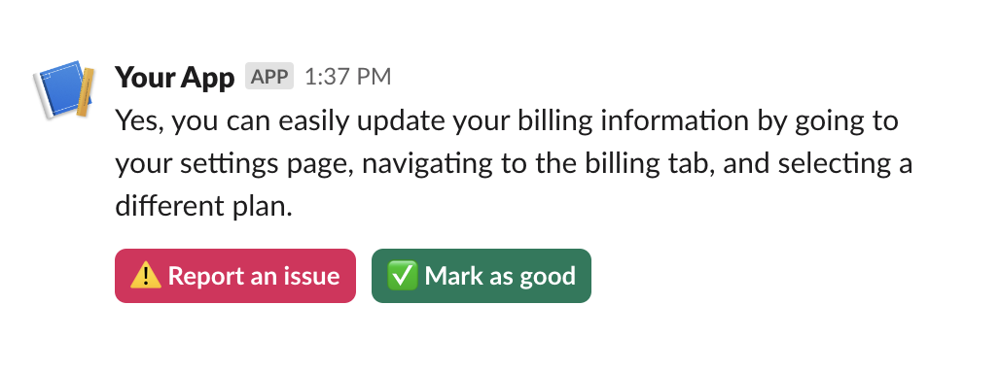

Are you using Slack as your channel for customer conversations? You can easily log Slack conversations to Melodi using any of our integration methods and collect in-app feedback from users using our feedback API.

## Implementation Options

<Tabs>
  <Tab title="Node.js (Express)">
    ```javascript
    const express = require('express');
    const app = express();

    app.post('/api/slack/interactions', async (req, res) => {
      const payload = JSON.parse(req.body.payload);
      
      // Extract relevant information
      const messageText = payload.message.text;
      const buttonValue = payload.actions[0].text.text;
      const userId = payload.user.id;
      
      // Determine feedback type
      const isBugReport = buttonValue.includes('Report an issue');
      
      // Send to Melodi
      await melodiClient.logFeedback({
        source: 'slack',
        content: messageText,
        userId: userId,
        feedbackType: isBugReport ? 'bug' : 'positive',
        metadata: {
          slackTeamId: payload.team.id,
          slackChannelId: payload.channel.id,
          slackMessageTs: payload.message.ts
        }
      });

      // Acknowledge the interaction
      res.status(200).send();
    });
    ```
    First, install Express:
    ```bash
    npm install express
    ```
  </Tab>

  <Tab title="Python (FastAPI)">
    ```python
    from fastapi import FastAPI, Request
    import json

    app = FastAPI()

    @app.post("/api/slack/interactions")
    async def handle_slack_interaction(request: Request):
        payload = json.loads((await request.form())["payload"])
        
        # Extract relevant information
        message_text = payload["message"]["text"]
        button_value = payload["actions"][0]["text"]["text"]
        user_id = payload["user"]["id"]
        
        # Determine feedback type
        is_bug_report = "Report an issue" in button_value
        
        # Send to Melodi
        melodi_client.log_feedback(
            source="slack",
            content=message_text,
            user_id=user_id,
            feedback_type="bug" if is_bug_report else "positive",
            metadata={
                "slack_team_id": payload["team"]["id"],
                "slack_channel_id": payload["channel"]["id"],
                "slack_message_ts": payload["message"]["ts"]
            }
        )
        
        return {"status": "success"}
    ```
    First, install FastAPI:
    ```bash
    pip install fastapi uvicorn
    ```
  </Tab>
</Tabs>

## Setup Steps

1. **Configure Your Slack App**
   - Go to [api.slack.com/apps](https://api.slack.com/apps)
   - Select your app or create a new one
   - Under "Interactivity & Shortcuts":
     - Toggle "Interactivity" on
     - Add your Request URL (e.g., `https://your-domain.com/api/slack/interactions`)

2. **Add Feedback Buttons**
   When creating your message blocks, include meaningful values that help identify the context


## Adding Feedback Buttons to Slack


<Tabs>
  <Tab title="Block Kit Builder">
    

    The easiest way to create your feedback buttons is using Slack's Block Kit Builder:
    
    1. Visit our [pre-built template](https://app.slack.com/block-kit-builder/T04RLPH5PNG#%7B%22blocks%22:%5B%7B%22type%22:%22section%22,%22text%22:%7B%22type%22:%22mrkdwn%22,%22text%22:%22Yes,%20you%20can%20easily%20update%20your%20billing%20information%20by%20going%20to%20your%20settings%20page,%20navigating%20to%20the%20billing%20tab,%20and%20selecting%20a%20different%20plan.%22%7D%7D,%7B%22type%22:%22actions%22,%22elements%22:%5B%7B%22type%22:%22button%22,%22text%22:%7B%22type%22:%22plain_text%22,%22emoji%22:true,%22text%22:%22%E2%9A%A0%EF%B8%8F%20Report%20an%20issue%22%7D,%22style%22:%22danger%22,%22value%22:%22click_me_123%22%7D,%7B%22type%22:%22button%22,%22text%22:%7B%22type%22:%22plain_text%22,%22emoji%22:true,%22text%22:%22%E2%9C%85%20Mark%20as%20good%22%7D,%22style%22:%22primary%22,%22value%22:%22click_me_123%22%7D%5D%7D%5D%7D)
    2. Customize the message text and button labels
    3. Copy the JSON payload for your implementation

    Here's the template being used:
    ```json
    {
      "blocks": [
        {
          "type": "section",
          "text": {
            "type": "mrkdwn",
            "text": "Your message here"
          }
        },
        {
          "type": "actions",
          "elements": [
            {
              "type": "button",
              "text": {
                "type": "plain_text",
                "emoji": true,
                "text": "⚠️ Report an issue"
              },
              "style": "danger",
              "value": "feedback_{{messageId}}_bug"
            },
            {
              "type": "button",
              "text": {
                "type": "plain_text",
                "emoji": true,
                "text": "✅ Mark as good"
              },
              "style": "primary",
              "value": "feedback_{{messageId}}_good"
            }
          ]
        }
      ]
    }
    ```


  </Tab>

  <Tab title="Best Practices">
    ### Button Design Tips
    - Use clear, action-oriented button labels
    - Include emojis for visual clarity (⚠️, ✅)
    - Use meaningful `value` fields to track context
    
    ### Recommended Button Styles
    - Use `"style": "danger"` for issue reporting
    - Use `"style": "primary"` for positive feedback
    
    ### Value Format
    Structure your button values to include context:
    ```json
    "value": "feedback_{{messageId}}_{{type}}"
    ```
    
    This helps track:
    - Which message received feedback
    - What type of feedback was given
    - Any additional context you need
  </Tab>
</Tabs>

<Note>
  Remember to replace `{{messageId}}` with a unique identifier for your message. This helps link feedback to specific responses in your Melodi dashboard.
</Note>

## Handling Slack Interactions

When receiving interactions from Slack, it's important to verify the request and properly handle different interaction types.

### Request Verification

For security, verify that incoming requests are actually from Slack:

<Tabs>
  <Tab title="Node.js">
    ```javascript
    const crypto = require('crypto');
    
    function verifySlackRequest(req) {
      const signature = req.headers['x-slack-signature'];
      const timestamp = req.headers['x-slack-request-timestamp'];
      const body = req.rawBody; // You'll need to configure Express to preserve raw body
      
      const baseString = `v0:${timestamp}:${body}`;
      const hmac = crypto.createHmac('sha256', process.env.SLACK_SIGNING_SECRET)
        .update(baseString)
        .digest('hex');
      
      return `v0=${hmac}` === signature;
    }
    
    app.use('/api/slack/interactions', (req, res, next) => {
      if (!verifySlackRequest(req)) {
        return res.status(401).send('Unauthorized');
      }
      next();
    });
    ```
  </Tab>
  
  <Tab title="Python (FastAPI)">
    ```python
    import hmac
    import hashlib
    import time
    from fastapi import Request, HTTPException
    
    async def verify_slack_request(request: Request):
        signature = request.headers.get('x-slack-signature', '')
        timestamp = request.headers.get('x-slack-request-timestamp', '')
        body = await request.body()
        
        base_string = f"v0:{timestamp}:{body.decode()}"
        hmac_obj = hmac.new(
            bytes(SLACK_SIGNING_SECRET, 'utf-8'),
            bytes(base_string, 'utf-8'),
            hashlib.sha256
        )
        
        if not hmac.compare_digest(f"v0={hmac_obj.hexdigest()}", signature):
            raise HTTPException(status_code=401, detail="Invalid request signature")
    ```
  </Tab>
</Tabs>

### Handling Different Interaction Types

Slack can send different types of interactions. Here's how to handle them:

<Tabs>
  <Tab title="Node.js">
    ```javascript
    app.post('/api/slack/interactions', async (req, res) => {
      const payload = JSON.parse(req.body.payload);
      
      switch (payload.type) {
        case 'block_actions':
          // Handle button clicks
          await handleFeedbackButton(payload);
          break;
          
        case 'view_submission':
          // Handle modal submissions
          await handleModalSubmission(payload);
          break;
          
        case 'message_action':
          // Handle message shortcuts
          await handleMessageAction(payload);
          break;
      }
      
      res.status(200).send();
    });

    async function handleFeedbackButton(payload) {
      // Extract the feedback value from the button
      const buttonValue = payload.actions[0].value;  // e.g., "feedback_123_positive"
      const [_, threadId, messageId, feedbackType] = buttonValue.split('_');
      
      await melodiClient.logFeedback({
        threadId,
        messageId,
        feedback: {
          feedbackType: feedbackType.toUpperCase(), // Must be "POSITIVE" or "NEGATIVE"
          feedbackText: payload.message.text
        },
        user: {
          id: payload.user.id,
          email: `${payload.user.id}@slack.com` // Required field
        }
      });
    }
    ```
  </Tab>
  
  <Tab title="Python (FastAPI)">
    ```python
    @app.post("/api/slack/interactions")
    async def handle_slack_interaction(request: Request):
        payload = json.loads((await request.form())["payload"])
        
        if payload["type"] == "block_actions":
            await handle_feedback_button(payload)
        elif payload["type"] == "view_submission":
            await handle_modal_submission(payload)
        elif payload["type"] == "message_action":
            await handle_message_action(payload)
            
        return {"status": "success"}

    async def handle_feedback_button(payload):
        # Extract the feedback value from the button
        button_value = payload["actions"][0]["value"]  # e.g., "feedback_123_456_positive"
        _, thread_id, message_id, feedback_type = button_value.split("_")
        
        await melodi_client.log_feedback(
            thread_id=thread_id,
            message_id=message_id,
            feedback={
                "feedbackType": feedback_type.upper(),  # Must be "POSITIVE" or "NEGATIVE"
                "feedbackText": payload["message"]["text"]
            },
            user={
                "id": payload["user"]["id"],
                "email": f"{payload['user']['id']}@slack.com"  # Required field
            }
        )
    ```
  </Tab>
</Tabs>

### Button Value Format

When creating feedback buttons, use a consistent value format to make parsing easier:

```json
{
  "type": "button",
  "text": {
    "type": "plain_text",
    "text": "✅ Mark as helpful"
  },
  "style": "primary",
  "value": "feedback_{{threadId}}_{{messageId}}_POSITIVE"
}
```

The value format `feedback_{{threadId}}_{{messageId}}_{{type}}` allows you to:
- Identify the interaction type (`feedback`)
- Link the feedback to a specific thread (`threadId`)
- Link the feedback to a specific message (`messageId`)
- Specify the feedback type (`POSITIVE` or `NEGATIVE`)

<Note>
  Remember that feedbackType must be either "POSITIVE" or "NEGATIVE" and the user email is a required field when creating feedback.
</Note>
