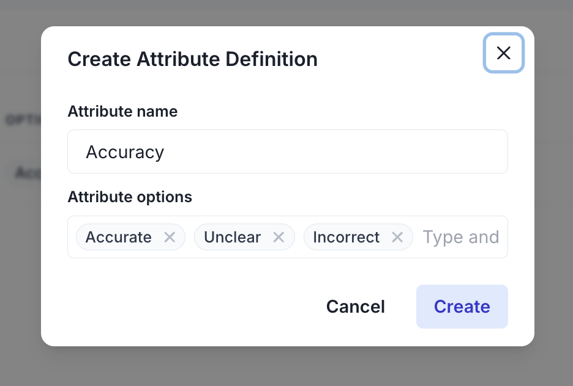

There are a few types of data to send to Melodi: projects, threads (which contains messages), user feedback, users, and external IDs.

## Projects

Melodi provides a number of ways to integrate with your application. To get started, create a project via the [Python](/integrating-melodi-analytics/python-sdk) or [Typescript](/integrating-melodi-analytics/typescript-sdk) SDKs, the [React component](/integrating-melodi-analytics/react-component), or directly in the Melodi UI. Then you can create threads, messages, user feedback, and users.

Projects are the top level container in Melodi. You can have multiple projects, each with their own threads, users, and feedback. In general, a project is a single product or feature. For example, you might have a project for a customer support chatbot and a separate project for a financial assistant.


## Threads and Messages

Threads are the main way to track interactions with your AI models. In the Melodi UI, threads are called "Sessions", similar to how "sessions" is used to describe user activity on a website or app.

Threads are composed of messages, which have an externalID, role (user, assistant, RAG lookup, etc.) and message content. You can also add metadata to threads, which will allow you to filter and segment your data in the UI.

[View the sessions page in the Melodi UI](https://app.melodi.fyi/admin/threads)


### Message Types

Messages in a thread can be one of two types: `markdown` or `json`. All messages require a `role` field, and can optionally include `metadata` and `externalId`.

<Tip>
  Roles labeled as "user" will be rendered green in the UI, while "assistant"
  will be rendered blue. All other strings appear gray.
</Tip>

<Tabs>
  <Tab title="Markdown Messages">
    **Markdown Messages** (default)
    - Used for standard text content
    - When `type: 'markdown'` (default if not specified)
    - Content goes in the `content` field

    ```typescript
    {
      type: 'markdown',
      role: 'user',
      content: 'Hello world',
      metadata: {} // optional
    }
    ```

  </Tab>
  <Tab title="JSON Messages">
    **JSON Messages**
    - Used for structured data or tool outputs
    - Must set `type: 'json'`
    - Data goes in the `jsonContent` field

    ```typescript
    {
      type: 'json',
      role: 'function',
      jsonContent: {
        temperature: 72,
        humidity: 45
      },
      metadata: {} // optional
    }
    ```

  </Tab>
</Tabs>

### Visual Example

Here's how your thread will appear in the Melodi dashboard:


## User Feedback

User feedback can be positive or negative or associated with attributes like "incorrect", "helpful", or "source issue". These attributes can be created from the Settings page.



When creating feedback, you need to specify:

- `feedbackType`: Either 'POSITIVE' or 'NEGATIVE'
- `externalThreadId`: The thread ID to attach feedback to
- Optional fields:
  - `feedbackText`: Additional text feedback
  - `externalMessageId`: Specific message ID (defaults to last message)
  - `projectId`: Recommended to ensure correct thread identification
  - `attributes`: Key-value pairs matching your configured attributes

```typescript
{
  feedbackType: 'POSITIVE',
  externalThreadId: 'chat_123',
  feedbackText: 'Very helpful response!',
  attributes: {
    Quality: 'Wonderful',
    Relevance: 'High'
  }
}
```

User feedback can be collected via the Melodi feedback widget or through your own feedback UI with Melodi's [feedback API](/api-reference/create-feedback).

Feedback will appear on the session page.


Feedback will also appear on the Melodi dashboard.

## Users

Tracking user data is not required, but highly recommended in order to calculate metrics like active users, retention, and churn. User segments are useful for tracking categories like "internal" vs "external" users, or "paid" vs "free" users. Users are available on the /users page in the Melodi UI.


Users can be created or updated with the following information:

- Required: `externalId` (unique identifier for the user)
- Optional:
  - `email`
  - `name`
  - `username`
  - `segments`: Key-value pairs for user categorization

```typescript
{
  externalId: "user_123",
  email: "user@example.com",
  name: "John Doe",
  segments: {
    "team": "engineering",
    "role": "developer"
  }
}
```

## External IDs

Melodi uses external IDs to make it easy to reference your data without having to store Melodi's internal IDs. You can provide your own IDs when creating:

- Threads (`externalThreadId`)
- Messages (`externalMessageId`)
- Users (`externalUserId`)

These external IDs can then be used in subsequent API calls. For example, when creating feedback, you can reference the thread, message, and user using their external IDs:

```typescript
{
externalThreadId: "chat_123",
externalMessageId: "msg_456",
externalUser: {
externalId: "user_789"
},
```
