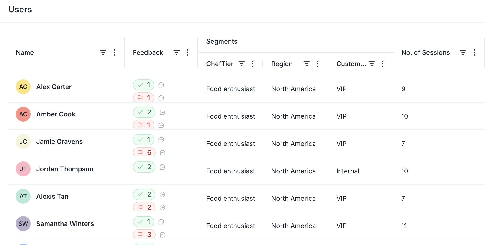

Melodi provides a number of ways to integrate with your application. To get started, create a project via the SDKs, the API directly, or the React component Then you can create threads, messages, user feedback, and users.

Create a project
Projects are the top level container in Melodi. You can have multiple projects, each with their own threads, users, and feedback. In general, a project is a single product or feature. For example, you might have a project for a customer support chatbot and a separate project for a financial assistant.

You can create a project via the SDKs, [API](/api-reference/create-project), or in the Melodi UI by clicking the "New Project" button.

Create threads

Threads are the main way to track interactions with your AI models. They are composed of flexible messages, which can be from users or from your AI models, including RAG lookups. You can also add metadata to threads, which will allow you to filter and segment your data in the UI. Threads are called "Sessions" in the Melodi UI, similar to how "sessions" is used to describe user activity on a website or app.

Messages from threads will be displayed in the UI so users can easily view and even edit the conversation.

Threads are available on the /sessions page in the Melodi UI.

Create user feedback

User feedback can be positive or negative, and can be added to threads. You can also add feedback attributes like "incorrect", "helpful", or "source issue" to better understand how your users think about AI model responses and identify opportunities for improvement. User feedback can be collected via the Melodi feedback widget or through your own feedback UI with Melodi's [feedback API](/api-reference/create-feedback).

Feedback will appear on the session page. 

Feedback will also appear on the Melodi dashboard.

Users
Tracking users is optional, but highly recommended in order to calculate metrics like active users, retention, and churn. User segments are useful for tracking categories like "internal" vs "external" users, or "paid" vs "free" users. Users can be tracked automatically or added manually. Users are available on the /users page in the Melodi UI. 

