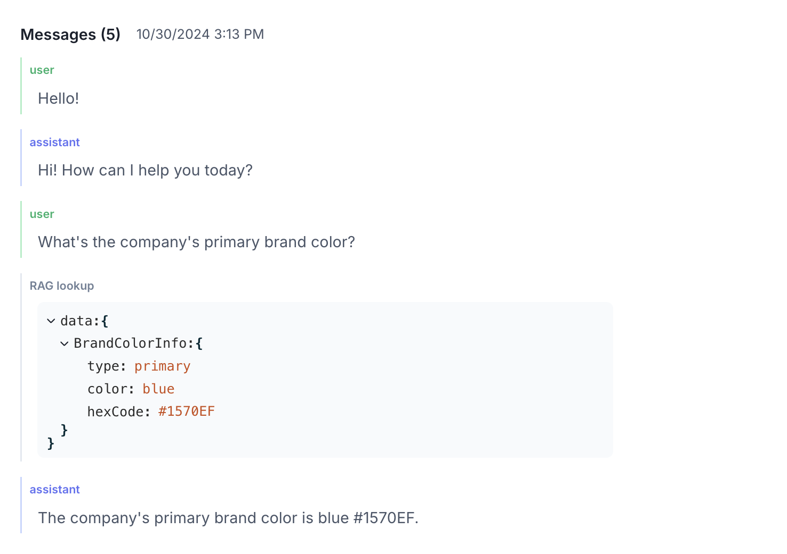

## Initial set up
Import required modules for Threads, Messages, Feedback, and Users.

```python
from melodi.melodi_client import MelodiClient
from melodi.feedback.data_models import Feedback
from melodi.threads.data_models import Message, Thread
from melodi.users.data_models import User
```

## Set up the Melodi client
Your API key can be found in Settings. For more information, see [API Access](/pages/api-access).
```python
import os

os.environ["MELODI_API_KEY"] = "<YOUR_KEY>"

client = MelodiClient(verbose=True)
```

## Create a project
Projects can also be created via the UI. Existing project IDs can be found in the URL e.g. `https://app.melodi.fyi/admin/users?projectId=708`
```python
new_project = client.projects.create("Melodi SDK Test")

print(new_project.id)
```
## Create a thread in Melodi
Threads are a flexible data format that support customizable message types, including user, AI response, RAG lookup, and other.

For more information, see the [Create Thread API documentation](/page/create-thread).

```python
melodiClient = MelodiClient(verbose=True)

threadExternalId = "external-thread-id-1"

externalUser = User(
    externalId="test-user-id-1",
    name="Test User",
    email="test-user@example.com",
    segments={
      "team": "engineering",
    }
)

message1 = Message(
    externalId="message1",
    role='user',
    content='Tell me a joke',
)

message2 = Message(
    externalId="message2",
    role='json_tool',
    type='json',
    jsonContent={
        "joke_setup": "Why did the chicken cross the road?",
        "joke_punchline": "To get to the other side!"
    },
    metadata={
        "metadatatest": "value2"
    },
)

message3 = Message(
    externalId="message3",
    role='assistant',
    content='Why did the chicken cross the road? To get to the other side!',
    metadata={
        "metadatatest": "value3"
    },
)

thread = Thread(
    projectName="Melodi SDK Test",
    externalId=threadExternalId,
    messages=[message1, message2, message3],
    externalUser=externalUser
)
melodi_thread = melodiClient.threads.create_or_update(thread)

print(melodi_thread)
```

This is how a thread will render in Melodi.



## Add feedback to the thread
```python
feedback = Feedback(
    externalThreadId=threadExternalId,
    feedbackText="I don't understand",
    feedbackType="NEGATIVE"
)

melodi_feedback = melodiClient.feedback.create(feedback)
print(melodi_feedback)
```

## Add feedback with attributes
Feedback can have different attributes, like quality, that can be passed at the same time.

```python
feedback_with_attributes = Feedback(
    externalThreadId=threadExternalId,
    feedbackText="This is so funny",

    # These attributes and options need to already exist in your organization
    # Or this call will fail
    attributes={
      "Humor Level": "High",
    }
)

melodi_feedback_with_attributes = melodiClient.feedback.create(feedback_with_attributes)
print(melodi_feedback_with_attributes)
```

## Create or update a user
If you are on an enterprise plan, we can work with you to manager your user data.
```python
user = User(
    externalId="test-user-id-2",
    name="Different User",
    email="differentuser@example.com",
    segments={
      "team": "sales",
    }
)

melodi_user = client.users.create_or_update(user)
print(melodi_user)
```